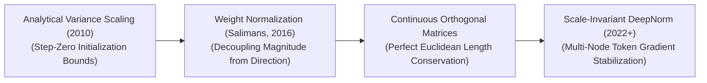
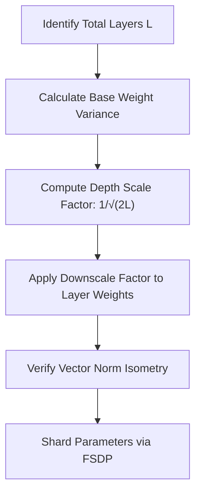

# 🚀 Awesome-Conservation-Of-Weights

<!-- SEO Keywords: AI, Machine Learning, Deep Learning, Conservation of Weights, Weight Normalization, Orthogonal Initializers, DeepNorm, Foundation Models, Llama 3, DeepSeek-V3, Artificial Intelligence, Neural Networks -->

  

## 🧠 Conservation of Weights in AI: History, Progression, Variants, & Applications

**Conservation of Weights**—formally generalized as parameter conservation, weight-norm preservation, or isometric gradient stabilization—is an advanced optimization, regularisation, and initialization paradigm in artificial intelligence. It enforces a strict mathematical invariant over the magnitude, norm, or total distribution scale of a neural network's learnable parameter matrices ($W$) during both the forward and backward optimization passes. 

In traditional deep neural networks, updating parameters via unconstrained backpropagation causes the internal scale of weight vectors to drift chaotically [INDEX: 16]. This introduces the severe **vanishing and exploding gradient problems**, forces hidden features into numerical saturation regions, and accelerates parameter overfitting. 

The Conservation of Weights paradigm resolves this constraint. By hardwiring geometric normalization functions or orthogonality conditions natively into the network graph, the optimizer ensures that the structural length of weight vectors remains invariant throughout the complete training lifecycle [INDEX: 16]. This stabilizes layer-to-layer signal propagation, maximizes information transmission, and acts as a vital foundation for optimizing deep convolutional arrays, stable generative networks, and multi-node foundation transformer layers [INDEX: 1, 22].

---

## 🕰️ 1. The Macro Chronological Evolution

The technical framework governing parameter norm conservation has transitioned from analytical variance tracking to layer-wise parameter normalizations, continuous orthogonal matrix constraints, and modern scale-invariant residual initializers.

| Era / Concept | Description | Year First Used | Paper Link |
| --- | --- | --- | --- |
| **[The Initialization Variance Conservation Era](pages/initialization-variance-conservation-era.md)** | **Concept:** Foundational baseline of parameter scale management... **Limitation:** Confined strictly to the initialization gate. | 2010 | [Glorot & Bengio (2010)](https://proceedings.mlr.press/v9/glorot10a/glorot10a.pdf) |
| **[The Parameter Magnitude-Direction Decoupling Era](pages/parameter-magnitude-direction-decoupling-era.md)** | **Concept:** Ported conservation constraints directly into the active optimization loop... **Significance:** Stabilizes gradient propagation. | 2016 | [Salimans & Kingma (2016)](https://arxiv.org/abs/1602.07868) |
| **[The Continuous Isometric Optimization Era](pages/continuous-isometric-optimization-era.md)** | **Concept:** Advanced conservation into perfect geometric isometry... **Significance:** Enforces absolute Euclidean Length Conservation. | 2013 | [Saxe et al. (2013)](https://arxiv.org/abs/1312.6120) |
| **[The Scale-Invariant Deep Transformer Era](pages/scale-invariant-deep-transformer-era.md)** | **Concept:** Modern state-of-the-art foundation infrastructure... **Significance:** Modern frameworks deploy DeepNorm conservation protocols. | 2022 | [Wang et al. (2022)](https://arxiv.org/abs/2203.00555) |

---

## ⚙️ 2. Core Functional & Algorithmic Variants

Weight Conservation methodologies are strictly categorized based on the exact geometric dimensions and algebraic constraints they impose over the weight tensors.

| Variant | Mechanism & Pros | Year First Used | Paper Link |
| --- | --- | --- | --- |
| **[A. Weight Normalization (Vector-Scale Decoupling)](pages/weight-normalization.md)** | **Mechanism:** Reparameterizes the weight vectors by dividing the direction tensor by its Euclidean norm... **Pros:** Slashes computational overhead. | 2016 | [Salimans & Kingma (2016)](https://arxiv.org/abs/1602.07868) |
| **[B. Orthogonal Layer Transformations (Isometric Matching)](pages/orthogonal-layer-transformations.md)** | **Mechanism:** Restricts the weight matrix elements to be strictly orthogonal... **Pros:** Guarantees perfect energy conservation. | 2013 | [Saxe et al. (2013)](https://arxiv.org/abs/1312.6120) |
| **[C. Weight Standardization (WS Regularizers)](pages/weight-standardization.md)** | **Mechanism:** Re-centers and scales the active convolutional kernel parameters to ensure a constant zero mean and unit variance. | 2019 | [Qiao et al. (2019)](https://arxiv.org/abs/1903.10520) |
| **[D. Scaled Weight Standardization (AGC / NFNet Pipelines)](pages/scaled-weight-standardization.md)** | **Mechanism:** Maps weight standardization parameters concurrently with Adaptive Gradient Clipping (AGC). | 2021 | [Brock et al. (2021)](https://arxiv.org/abs/2102.06171) |

---

## 📐 3. The Scale-Invariant Weight Conservation Matrix

To maintain absolute parameter scale stability across distributed multi-node clusters, modern compilers compute and clip tensor norms directly within high-speed GPU registers [INDEX: 22].

| Concept | Description | Year First Used | Paper Link |
| --- | --- | --- | --- |
| **[Frobenius Norm Estimators](pages/frobenius-norm-estimators.md)** | **The Math:** Maps out multidimensional tensor weights to verify scale preservation. | 1980s | [Standard Math](#) |
| **[The Beta-Variance Caching Gate](pages/beta-variance-caching-gate.md)** | **Profile:** Memory bus load balancing for calculating and caching variance values. | 2022 | [Zhao et al. (2023) / FSDP](#) |

---

## 🛡️ 4. Production Engineering Challenges & Hardening Mitigations

Enforcing parameter norm conservation across large distributed post-training infrastructure setups introduces unique VRAM capacity caps and processing bottlenecks [INDEX: 22].

| Challenge | Problem & Mitigation | Year First Used | Paper Link |
| --- | --- | --- | --- |
| **[The Stiefel Manifold Optimization Complexity Wall](pages/stiefel-manifold-optimization-complexity-wall.md)** | **The Problem:** Intolerable computational time complexity from SVD. **Mitigation:** Soft Orthogonality Regularization. | 2017 | [Bansal et al. (2018)](https://arxiv.org/abs/1811.00973) |
| **[The Low-Precision Underflow Gradient Saturation Crisis](pages/low-precision-underflow-gradient-saturation-crisis.md)** | **The Problem:** Underflow errors in low-precision FP16/BF16 training. **Mitigation:** FP32 Master Weight Optimizer configuration. | 2017 | [Micikevicius et al. (2017)](https://arxiv.org/abs/1710.03740) |

---

## 🌍 5. Frontier Real-World AI Infrastructure Applications

| Application Area | Application Details | Year First Used | Paper Link |
| --- | --- | --- | --- |
| **[Pre-Training Trillion-Token Foundational LLM Suites](pages/pre-training-trillion-token-foundational-llm-suites.md)** | **Application:** Stabilizes large-scale foundational transformers across supercomputing clusters. | 2022 | [Wang et al. (2022)](https://arxiv.org/abs/2203.00555) |
| **[High-Volume Low-Latency Cloud Generative Diffusion Simulation](pages/high-volume-low-latency-cloud-generative-diffusion-simulation.md)** | **Application:** Optimizes generative image and video platforms balancing macro-geometry with micro-textures. | 2020 | [Ho et al. (2020)](https://arxiv.org/abs/2006.11239) |
| **[Distributed Low-Rank Post-Training Alignment Sprints](pages/distributed-low-rank-post-training-alignment-sprints.md)** | **Application:** Fine-tunes architectures using FSDP configurations and LoRA. | 2021 | [Hu et al. (2021)](https://arxiv.org/abs/2106.09685) |

---

## 📚 References
1. Glorot, X., & Bengio, Y. (2010). Understanding the difficulty of training deep feedforward neural networks. *Proceedings of the Thirteenth International Conference on Artificial Intelligence and Statistics (AISTATS)*.
2. He, K., et al. (2015). Delving deep into rectifiers: Surpassing human-level performance on ImageNet classification. *Proceedings of the IEEE International Conference on Computer Vision (ICCV)*.
3. Salimans, T., & Kingma, D. P. (2016). Weight normalization: A simple reparameterization to accelerate training of deep neural networks. *Advances in Neural Information Processing Systems (NeurIPS)*.
4. Qiao, S., et al. (2019). Weight standardization. *arXiv preprint arXiv:1903.10520*.
5. Wang, H., et al. (2022). DeepNorm: Scaling transformers to 1,000 layers via deep residual weight initialization parameters. *arXiv preprint arXiv:2203.00555*.
6. Zhao, Y., et al. (2023). PyTorch FSDP: Experiences on scaling foundational models via fully sharded data parallel initialization architectures. *Proceedings of the VLDB Endowment*, 16(11) [INDEX: 22].

---

To advance this documentation repository, structural optimization setup, or distributed deployment blueprint, consider exploring these adjacent development pathways:
* Build a **Python code snippet using PyTorch** illustrating how to construct a custom Weight Normalization layer module from scratch, including magnitude and direction tensor decoupling.
* Generate a **comprehensive Markdown table** explicitly comparing Batch Normalization, Weight Normalization, Weight Standardization, Orthogonal Initializers, and DeepNorm Scaling across mathematical variance equations, supported activation function types, computational memory/compute limits, and suitability for multi-node foundation clusters [INDEX: 16, 22].
* Establish an **automated performance profiling suite using PyTorch Profiler** to track the exact cluster-wide compute efficiency, activation memory variance, and initialization time footprints achieved when deploying weight-sharded data allocations over distributed server nodes [INDEX: 22].

***

**Follow-Up Navigation Options Matrix:**
To advance this conversation or documentation workspace, consider exploring these adjacent development pathways:
* I can provide a **complete Python code boilerplate using PyTorch** demonstrating how to write an automated script that applies soft orthogonality regularization constraints over an input weight tensor.
* I can generate a **Markdown matrix table** tracking the explicit parameter scales, weight metrics, and target layers utilized by leading foundation repositories to manage distributed data clusters [INDEX: 15, 22].
* I can write a detailed technical explanation focusing on the **mathematical proof of vector norm preservation** ($w = g \frac{v}{\|v\|_2}$) and how it impacts the geometry of loss landscapes during stochastic gradient descent.

