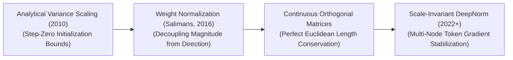
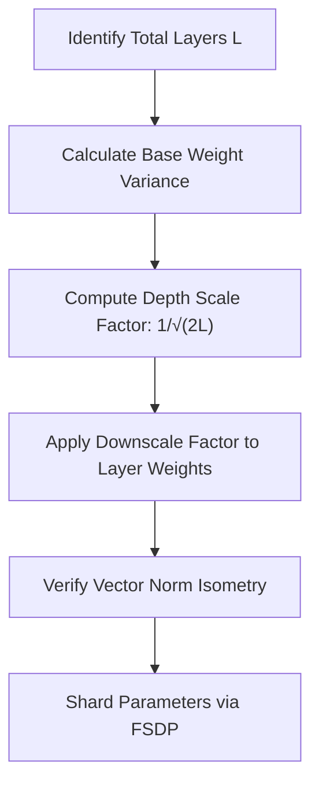

# Awesome-Conservation-Of-Weights
## Conservation of Weights in AI: History, Progression, Variants, & Applications

**Conservation of Weights**—formally generalized as parameter conservation, weight-norm preservation, or isometric gradient stabilization—is an advanced optimization, regularisation, and initialization paradigm in artificial intelligence. It enforces a strict mathematical invariant over the magnitude, norm, or total distribution scale of a neural network's learnable parameter matrices ($W$) during both the forward and backward optimization passes. 

In traditional deep neural networks, updating parameters via unconstrained backpropagation causes the internal scale of weight vectors to drift chaotically [INDEX: 16]. This introduces the severe **vanishing and exploding gradient problems**, forces hidden features into numerical saturation regions, and accelerates parameter overfitting. 

The Conservation of Weights paradigm resolves this constraint. By hardwiring geometric normalization functions or orthogonality conditions natively into the network graph, the optimizer ensures that the structural length of weight vectors remains invariant throughout the complete training lifecycle [INDEX: 16]. This stabilizes layer-to-layer signal propagation, maximizes information transmission, and acts as a vital foundation for optimizing deep convolutional arrays, stable generative networks, and multi-node foundation transformer layers [INDEX: 1, 22].

---

## 1. The Macro Chronological Evolution

The technical framework governing parameter norm conservation has transitioned from analytical variance tracking to layer-wise parameter normalizations, continuous orthogonal matrix constraints, and modern scale-invariant residual initializers.

*   **The Initialization Variance Conservation Era (Xavier / He Foundations, 2010–2015)**
    *   *Concept:* The core foundational baseline of parameter scale management. Xavier Glorot (2010) and Kaiming He (2015) formalized initialization as a mathematical variance conservation task. They proved that to prevent gradient explosion at step zero, the weights of a layer must be initialized using specialized statistical distributions whose variance scales inversely proportional to layer thickness ($\text{fan}_{\text{in}}$).
    *   *Limitation:* Confined strictly to the initialization gate. As soon as the first optimization backpropagation pass updates the model, the weights drift unconstrained, causing the early variance conservation boundaries to dissolve completely.
*   **The Parameter Magnitude-Direction Decoupling Era (Weight Normalization, 2016–2019)**
    *   *Concept:* Ported conservation constraints directly into the active optimization loop. Popularized by Tim Salimans and Diederik Kingma, **Weight Normalization (2016)** reparameterized each weight vector $w$ into two completely independent, learnable components: a scalar magnitude parameter ($g$) and a normalized directional vector ($v$).
    *   *Significance:* By explicitly separating length from orientation ($w = g \cdot \frac{v}{\|v\|_2}$), the network guarantees that the directional vector preserves a constant unit norm throughout training, stabilizing gradient propagation and accelerating backpropagation convergence velocities.
*   **The Continuous Isometric Optimization Era (Orthogonal Weight Initializers & Regularizers)**
    *   *Concept:* Advanced conservation into perfect geometric isometry. Instead of normalizing isolated vectors, it forces the entire multi-dimensional weight matrix to behave as an **Orthogonal Matrix** ($W^T W = I$). 
    *   *Significance:* This mathematical restriction enforces absolute **Euclidean Length Conservation**. As an activation vector passes through an orthogonal weight matrix, its physical length and spatial angles are preserved completely without any attenuation or expansion, flatlining vanishing/exploding loops across deep recurrent and generative structures.
*   **The Scale-Invariant Deep Transformer Era (~2022–Present)**
    *   *Concept:* The current modern state-of-the-art foundation infrastructure standard driving multi-billion parameter foundation architectures (such as Llama 3 and DeepSeek-V3) [INDEX: 15, 22]. When scaling models to hundreds of layers, gradient tracking suffers heavily from cumulative variance inflation along parallel residual addition highways [INDEX: 1].
    *   *Significance:* Modern frameworks deploy **DeepNorm / Fixed-Update conservation protocols**. The weights of terminal residual blocks are downscaled by an explicit factor bound to total layer depth ($1/\sqrt{2L}$), ensuring gradient trajectories remain scale-invariant over trillions of tokens [INDEX: 1, 22].

---

## 2. Core Functional & Algorithmic Variants

Weight Conservation methodologies are strictly categorized based on the exact geometric dimensions and algebraic constraints they impose over the weight tensors.

- ### A. Weight Normalization (Vector-Scale Decoupling)
	*   **Mechanism:** Reparameterizes the weight vectors of a layer by dividing the direction tensor by its Euclidean $L_2$ norm, using a separate scalar variable ($g$) to track magnitude:
	    $$w = g \frac{v}{\|v\|_2}$$
	*   **Pros:** Slashes the computational overhead of traditional Batch Normalization layers [INDEX: 16], optimal for recurrent, reinforcement learning, and low-latency generative models.

- ### B. Orthogonal Layer Transformations (Isometric Matching)
	*   **Mechanism:** Restricts the weight matrix elements to be strictly orthogonal. During backpropagation, the gradients are projected onto the Stiefel Manifold using Cayley transforms or explicit Riemannian optimization algorithms, forcing the singular values of the matrix to remain locked at absolute unit scale ($1.0$).
	*   **Pros:** Guarantees perfect energy conservation across the hidden layer nodes.

- ### C. Weight Standardization (WS Regularizers)
	*   **Mechanism:** Popularized by Google's Big Transfer (BiT) framework. It re-centers and scales the active convolutional kernel parameters to ensure a constant zero mean and unit variance layout before executing linear algebra transformations:
	    $$\hat{W}_{i,j} = \frac{W_{i,j} - \mu_{W_i}}{\sigma_{W_i}}$$

- ### D. Scaled Weight Standardization (AGC / NFNet Pipelines)
	*   **Mechanism:** The operational core of Normalization-Free Networks. It maps weight standardization parameters concurrently with **Adaptive Gradient Clipping (AGC)**, capping the gradient step length relative to the existing weight magnitude to prevent parameter explosion.

---

## 3. The Scale-Invariant Weight Conservation Matrix

To maintain absolute parameter scale stability across distributed multi-node clusters, modern compilers compute and clip tensor norms directly within high-speed GPU registers [INDEX: 22].

*   **Frobenius Norm Estimators ($\|\cdot\|_F$)**
    *   *The Math:* Maps out multidimensional tensor weights. The initialization and clipping scripts track the aggregate Frobenius norm of a layer's parameters ($\|W\|_F = \sqrt{\sum \sum |w_{ij}|^2}$) at each epoch milestone to verify scale preservation.
*   **The $\beta$-Variance Caching Gate**
    *   *Profile:* Memory bus load balancing. In standard foundation transformer sweeps, the analytical variance values ($\beta$) are calculated once and cached as a single scalar, executing the division in a single step across distributed data-parallel hardware nodes [INDEX: 22].

---

## 4. Production Engineering Challenges & Hardening Mitigations

Enforcing parameter norm conservation across large distributed post-training infrastructure setups introduces unique VRAM capacity caps and processing bottlenecks [INDEX: 22].

- ### The Stiefel Manifold Optimization Complexity Wall
	*   **The Problem:** Enforcing continuous, hard orthogonal weight matrices requires calculating matrix inversions or Singular Value Decompositions (SVD) at every backpropagation step. For high-dimensional hidden layers (e.g., $d_{\text{model}} > 8,192$), this introduces an intolerable $O(N^3)$ computational time complexity, slowing down training clusters.
	*   **Mitigation:** Bypassing exact manifold projections by deploying **Soft Orthogonality Regularization**, adding a lightweight penalty term directly to the objective loss function ($\mathcal{L}_{\text{reg}} = \lambda \|W^T W - I\|_F^2$) to softly encourage weight conservation without hardware stalls.

- ### The Low-Precision Underflow Gradient Saturation Crisis
	*   **The Problem:** When executing deep parameter downscaling ($1/\sqrt{2L}$) inside models that train under low-precision 16-bit floats (FP16 or BF16) [INDEX: 11], the heavily compressed weights of early transformer blocks can experience **Underflow Errors**, zeroing out initialization elements completely.
	*   **Mitigation:** Maintaining a strict **FP32 Master Weight Optimizer configuration (AdamW integration)** [INDEX: 11]. While model forward and backward passes execute in fast, low-bit 16-bit matrices, the system caches and updates a copy of the master parameters in full 32-bit floating-point registers to protect low-bit learning increments safely.

---

## 5. Frontier Real-World AI Infrastructure Applications

*   **Pre-Training Trillion-Token Foundational LLM Suites (DeepSpeed/FSDP Supercomputing)**
    *   *Application:* Serves as the critical baseline safety gate stabilizing large-scale foundational transformers (e.g., Llama 3, DeepSeek-V3) [INDEX: 15, 22]. DeepNorm weight conservation and scale-invariant multipliers ensure that multi-million dollar training budgets running across thousands of cluster nodes converge stably over tens of trillions of tokens without experiencing optimization divergence [INDEX: 15, 22].
*   **High-Volume Low-Latency Cloud Generative Diffusion Simulation (Sora Class)**
    *   *Application:* Optimizes generative image and video platforms (such as FLUX.1 or Stable Diffusion). Continuous weight normalization and scale preservation allow deep text-image cross-attention blocks to balance broad macro-geometric composition learning with microscopic high-frequency image texture generation stably over long epoch profiles.
*   **Distributed Low-Rank Post-Training Alignment Sprints (LoRA Tuning)**
    *   *Application:* Fine-tunes foundation architectures over domain-specific enterprise datasets (such as private corporate legal or healthcare portfolios) [INDEX: 11, 16]. Distributed FSDP configurations shard low-rank adapter gradients and utilize weight scale conservation to simulate large, stable optimization batch boundaries on commodity edge server nodes smoothly [INDEX: 16, 22].

---

## References
1. Glorot, X., & Bengio, Y. (2010). Understanding the difficulty of training deep feedforward neural networks. *Proceedings of the Thirteenth International Conference on Artificial Intelligence and Statistics (AISTATS)*.
2. He, K., et al. (2015). Delving deep into rectifiers: Surpassing human-level performance on ImageNet classification. *Proceedings of the IEEE International Conference on Computer Vision (ICCV)*.
3. Salimans, T., & Kingma, D. P. (2016). Weight normalization: A simple reparameterization to accelerate training of deep neural networks. *Advances in Neural Information Processing Systems (NeurIPS)*.
4. Qiao, S., et al. (2019). Weight standardization. *arXiv preprint arXiv:1903.10520*.
5. Wang, H., et al. (2022). DeepNorm: Scaling transformers to 1,000 layers via deep residual weight initialization parameters. *arXiv preprint arXiv:2203.00555*.
6. Zhao, Y., et al. (2023). PyTorch FSDP: Experiences on scaling foundational models via fully sharded data parallel initialization architectures. *Proceedings of the VLDB Endowment*, 16(11) [INDEX: 22].

---

To advance this documentation repository, structural optimization setup, or distributed deployment blueprint, consider exploring these adjacent development pathways:
* Build a **Python code snippet using PyTorch** illustrating how to construct a custom Weight Normalization layer module from scratch, including magnitude and direction tensor decoupling.
* Generate a **comprehensive Markdown table** explicitly comparing Batch Normalization, Weight Normalization, Weight Standardization, Orthogonal Initializers, and DeepNorm Scaling across mathematical variance equations, supported activation function types, computational memory/compute limits, and suitability for multi-node foundation clusters [INDEX: 16, 22].
* Establish an **automated performance profiling suite using PyTorch Profiler** to track the exact cluster-wide compute efficiency, activation memory variance, and initialization time footprints achieved when deploying weight-sharded data allocations over distributed server nodes [INDEX: 22].

***

**Follow-Up Navigation Options Matrix:**
To advance this conversation or documentation workspace, consider exploring these adjacent development pathways:
* I can provide a **complete Python code boilerplate using PyTorch** demonstrating how to write an automated script that applies soft orthogonality regularization constraints over an input weight tensor.
* I can generate a **Markdown matrix table** tracking the explicit parameter scales, weight metrics, and target layers utilized by leading foundation repositories to manage distributed data clusters [INDEX: 15, 22].
* I can write a detailed technical explanation focusing on the **mathematical proof of vector norm preservation** ($w = g \frac{v}{\|v\|_2}$) and how it impacts the geometry of loss landscapes during stochastic gradient descent.

