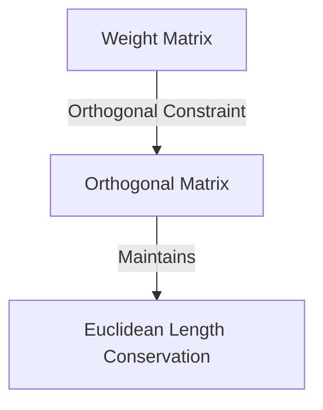

# The Continuous Isometric Optimization Era

Advanced conservation into perfect geometric isometry by forcing weight matrices to behave as Orthogonal Matrices.

## Diagram

[Back to README](../README.md)