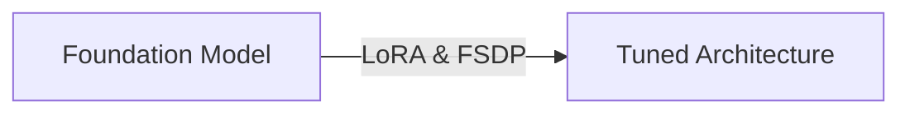

# Distributed Low-Rank Post-Training Alignment Sprints (LoRA Tuning)

Fine-tunes foundation architectures over enterprise datasets using distributed FSDP and LoRA.

## Diagram

[Back to README](../README.md)