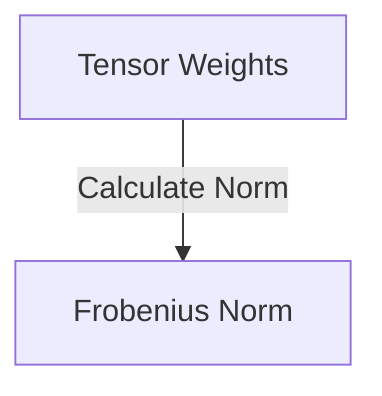

# Frobenius Norm Estimators

Tracks aggregate Frobenius norm of a layer's parameters to verify scale preservation.

## Diagram

```mermaid
graph TD
    T[Tensor Weights] -->|Calculate Norm| F[Frobenius Norm]
```

[Back to README](../README.md)