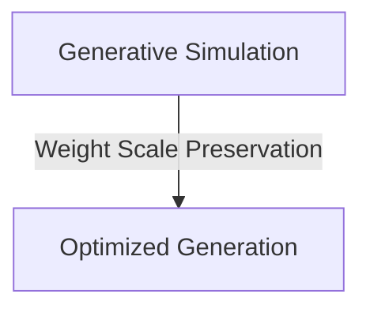

# High-Volume Low-Latency Cloud Generative Diffusion Simulation

Optimizes generative image and video platforms balancing macro-geometry with microscopic textures.

## Diagram

[Back to README](../README.md)