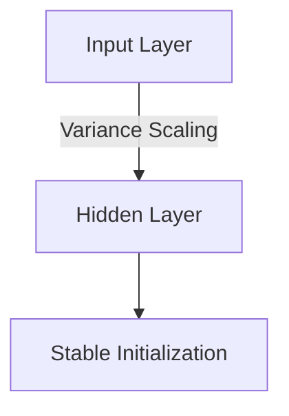

# The Initialization Variance Conservation Era

This era marks the foundational baseline of parameter scale management, pioneered by Xavier Glorot and Kaiming He.

## Diagram

[Back to README](../README.md)