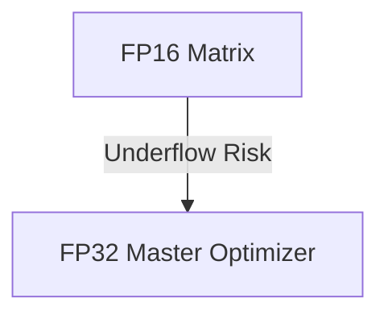

# The Low-Precision Underflow Gradient Saturation Crisis

Mitigates underflow errors in low-precision training using an FP32 Master Weight Optimizer.

## Diagram

```mermaid
graph TD
    F[FP16 Matrix] -->|Underflow Risk| M[FP32 Master Optimizer]
```

[Back to README](../README.md)