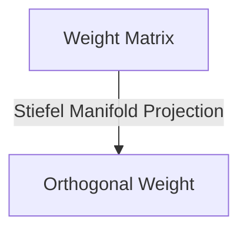

# Orthogonal Layer Transformations (Isometric Matching)

Restricts the weight matrix elements to be strictly orthogonal for perfect energy conservation.

## Diagram

```mermaid
graph TD
    W[Weight Matrix] -->|Stiefel Manifold Projection| O[Orthogonal Weight]
```

[Back to README](../README.md)