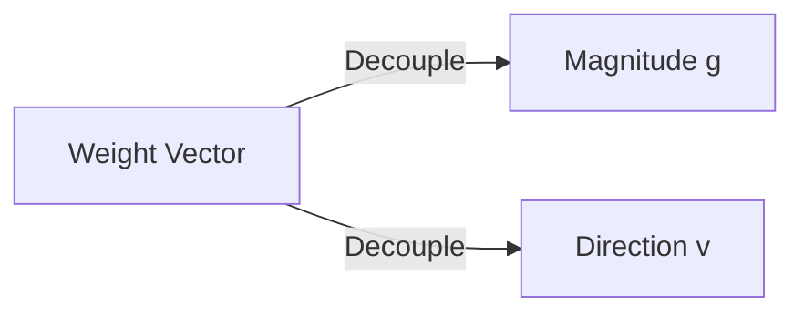

# The Parameter Magnitude-Direction Decoupling Era

Ported conservation constraints directly into the active optimization loop by reparameterizing each weight vector.

## Diagram

[Back to README](../README.md)