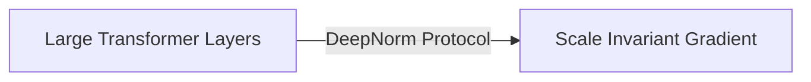

# The Scale-Invariant Deep Transformer Era

The current state-of-the-art foundation infrastructure standard driving multi-billion parameter foundation architectures.

## Diagram

[Back to README](../README.md)