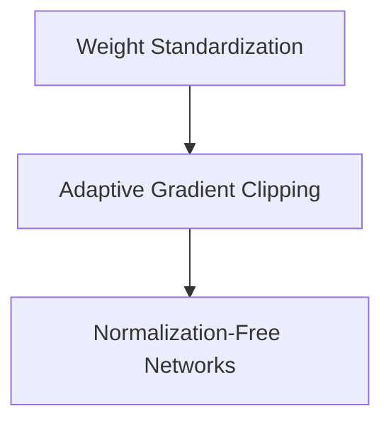

# Scaled Weight Standardization (AGC / NFNet Pipelines)

Maps weight standardization parameters concurrently with Adaptive Gradient Clipping.

## Diagram

```mermaid
graph TD
    W[Weight Standardization] --> A[Adaptive Gradient Clipping]
    A --> N[Normalization-Free Networks]
```

[Back to README](../README.md)