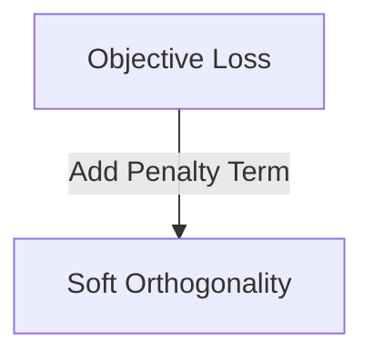

# The Stiefel Manifold Optimization Complexity Wall

Solves computational time complexity from exact manifold projections using Soft Orthogonality Regularization.

## Diagram

[Back to README](../README.md)