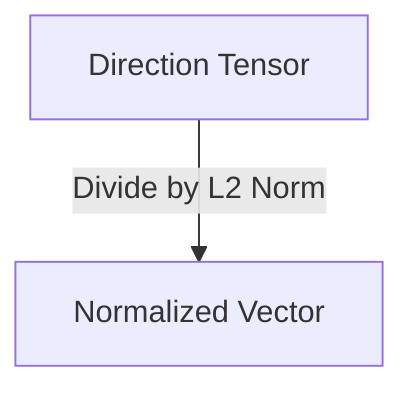

# Weight Normalization (Vector-Scale Decoupling)

Reparameterizes weight vectors by dividing the direction tensor by its Euclidean L2 norm.

## Diagram

```mermaid
graph TD
    D[Direction Tensor] -->|Divide by L2 Norm| N[Normalized Vector]
```

[Back to README](../README.md)