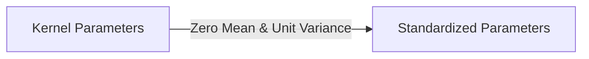

# Weight Standardization (WS Regularizers)

Re-centers and scales active convolutional kernel parameters to ensure constant zero mean and unit variance.

## Diagram

```mermaid
graph LR
    K[Kernel Parameters] -->|Zero Mean & Unit Variance| S[Standardized Parameters]
```

[Back to README](../README.md)